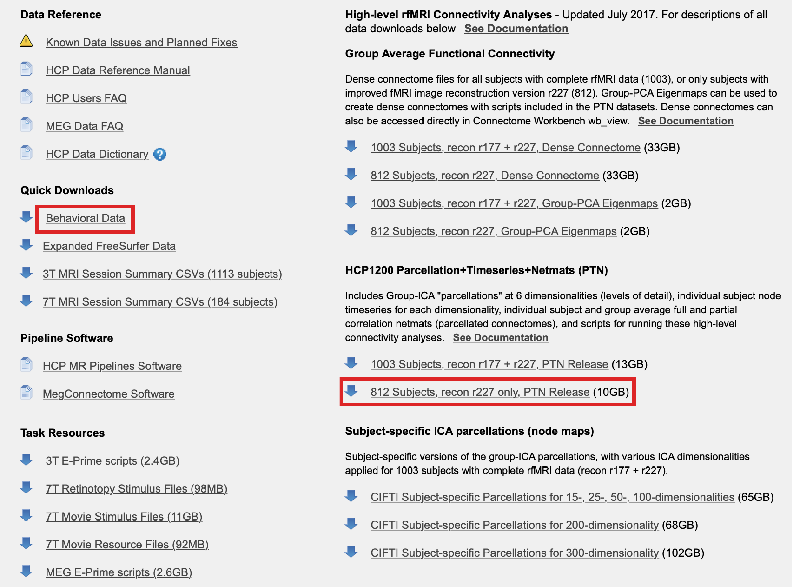

# Welcome to our coding interview

We want to get a sense of your ability to do some of more the specific tasks in the PennLINC laboratory. As a data analyst, a lot of your job will be data downloading, wrangling, and processing.

## Download functional connectivity matrices from the Human Connectome Project
### Connectome DB Account
Downloading this data requires making an account on their data downloader website [ConnectomeDB](https://db.humanconnectome.org/app/template/Login.vm).
### Aspera Connect Plug-In
You will also need a plug-in called [Aspera Connect](https://downloads.asperasoft.com/connect2/)
### Download the data! 
This specific dataset is called the [HCP1200 Parcellation + Timeseries + Netmats (1003 Subjects)](https://www.humanconnectome.org/storage/app/media/documentation/s1200/HCP1200-DenseConnectome+PTN+Appendix-July2017.pdf). We (i.e., you) are going to analyze the Netmats. They call them Netmats, which is short for network matrices, which are functional connectivity matrices. Once you are logged in to ConnectomeDB, and you have the plug-in active, you can download the data. It will be on [this page](https://db.humanconnectome.org/data/projects/HCP_1200). Please accept the data use agreement on the top right under "actions". Now the page should look like this, click the boxes in red:


This should take roughly 30 minutes and will require 10GB of space. Please let us know if your personal computing resources do not allow for this.

Open up a blank python script to start writing your code! From here on out, everything should be in your python script, and we should be able to run it. We are going to ask you to upload your code to github. Please make a *private* repo. You can start tracking your code now if you want. We are going to want to add three command line arguments. One for the location of the behavioral data file (the entire path), and then the root path to where the brain data is saved / where you downloaded it. This will allow us to tell the script where our data is stored and then run your code.

Your code should be able to be run with:
```bash
python solution_your_name.py data_root behavioral_csv output_dir
```
Where data_root is where we keep downloaded the data, behavioral_csv is where we keep the behavioral data file, and output_dir is where we want the results saved.

You will see multiple netmats_* files. For example, netmats_3T_HCP1200_MSMAll_ICAd200_ts2.tar.gz. The 200 here refers to the shape of the matrix, which is the number of *brain regions*. We refer to this parameter as the *resolution*. Anyways, let's be sure to make this clear when we unzip. Make sure to call the directories netmats200 and netmats300.

## Loading the matrices 

There are two scanning sessions, with a file for each (netmats1.txt,netmats2.txt). The matrices are in a bit of weird format, where it's one big file, and the first dimension is subjects (there are 812), second is connectivity. We reshape it to be a subject by region by region:

```python
import numpy as np
brain_regions = 200
netmat_matrix1 = np.loadtxt("HCP_PTN1200_recon2/netmats200/3T_HCP1200_MSMAll_d%s_ts2/netmats1.txt"%(brain_regions)).reshape(812,brain_regions,brain_regions)
# row zero, column 1 entry is the connectivity strength between node 0 and node 1. 
# since functional connectivity is not directed, entry 0,1 and entry 1,0 are identical.
```

## Save subject-level matrices

A big matrix like this is nice for speed, but part of your job will be tidying up data so mistakes are less likely to be made by others. We want a matrix saved for each subject, for both the 200 and 300 resolutions. Note that you will have to load netmats1.txt and netmats2.txt, and get the mean for each subject. Save the 200 region mean matrix for each subject in ../HCP_PTN1200_recon2/netmats200/netmats/3T_HCP1200_MSMAll_ICAd200_ts2/subject_matrices and the 300 region mean matrix for each subject in ../HCP_PTN1200_recon2/netmats300/netmats/3T_HCP1200_MSMAll_ICAd300_ts2/subject_matrices (you'll have to make that subject_matrices sub-directory).

Write code to do this so it can be run automatically.

You will have to use the 'subjectIDs_recon2.txt' file to do this. These subject IDs are ordered in the same order as the matrix. So:

```
matrix_102006 = netmat_matrix1[0]
matrix_100610 = netmat_matrix1[1]
```

In summary, in your netmats200/netmats/3T_HCP1200_MSMAll_ICAd200_ts2/ and netmats300/netmats/3T_HCP1200_MSMAll_ICAd300_ts2/ directories, you should have your *netmats1/2.txt*, and then another directory in each that has the subject matrices at that resolution.

## Analyze subject-level behavior matrices

Clean up the behavior file by loading it as a dataframe with [pandas](https://pandas.pydata.org/pandas-docs/stable/index.html). Let's call it "df". We want to analyze the "Flanker_AgeAdj" and the "ProcSpeed_AgeAdj" columns. You will also notice there are subjects in the behavior file with no matrices. Let's clean up the dataframe by only keeping the columns "Subject", "Flanker_AgeAdj", and "ProcSpeed_AgeAdj", and then create a new fourth column that denotes if the subject has a matrix with True or False. Call this column "has_matrix". Save this as a behavior.csv. 

Okay, now we have a nice clean dataframe with four columns.

A lot of the time, we want to know if variance in the strength of a connection (i.e., an entry in the matrices you have) correlates with a given behavior. Thus, run a Pearson *r* correlation between each connection in the 200 resolution matrix across subjects, and the "Flanker_AgeAdj" column in "df". You should store these correlations in a 200x200 matrix, where matrix[0,1] is the Pearson *r* between the strength of the connection from region 0 to region 1 across subjects and Flanker_AgeAdj. We can use the big matrices that has every subject's matrix for session 1 and session 2.

```python
import scipy.stats
mean_netmat = np.mean([netmat_matrix1,netmat_matrix2],axis=0) #get the mean across sessions
node_i = 0
node_j = 1
result_matrix = np.zeros((200,200))
result_matrix[node_i,node_j] = scipy.stats.pearsonr(mean_netmat[:,node_i,node_j],df.Flanker_AgeAdj.values)[0]
```
A lot of your job will be debugging code other people wrote. You will notice this code does not work! Fix what I messed up. 

Once you fix my code, you run it for every node_i and node_j combination so result_matrix is filled, except you can ignore the diagonal.

Now do this for 300 regions. Now do this for 200 and 300 regions for the "ProcSpeed_AgeAdj". 

Plot your 4 matrix results! I use [seaborn.heatmap](https://seaborn.pydata.org/generated/seaborn.heatmap.html). Try to make the figure look as nice as possible. 

```python
import seaborn as sns
import matplotlib.pylab as plt
sns.heatmap(result_matrix)
plt.savefig('result.pdf')
plt.show()
```

Bonus points for getting all four matrices in a single figure.

## Remove unused files 
Storage also costs money. Let's go through and delete all the files except the original large *netmats1/2.txt* matrix files for the 200 and 300 resolutions. Write code to do this so it can be run automatically. Don't delete those subject-level matrices, though! 

## GitHub
Save your script (or scripts) as a github repo. We should be able to clone your repo and, given that we have the same HCP Data, run your code to save the subject-level matrices, delete the data we don't need, and then generate the results and figure. Assume we have the basic [Anaconda](https://www.anaconda.com/products/individual) python packages, but feel free to include a dependency outside of that if you want. Finally, add us as collaborators so that we can see your code:

sydney.covitz@gmail.com
username: scovitz

mbertolero@me.com
username: mb3152

### Support or Contact
Having trouble? Email whomever has been facilitating your interview if there are any technical issues. If you would prefer interview in a language other than python, please reach out to us.
