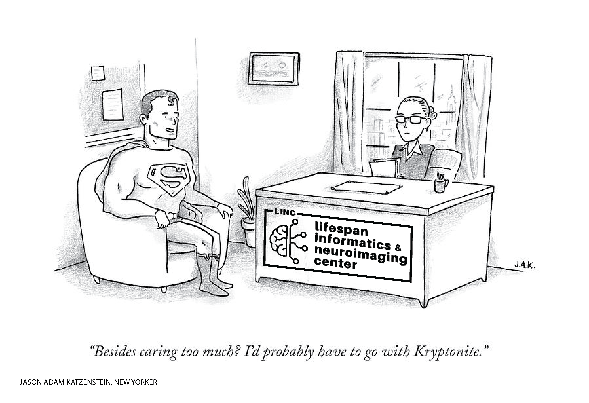

# Welcome to our coding aspect of the interview

We want to get a sense of your ability to do some of more specific tasks in the PennLINC labratory. As a data analyst, a lot of your job will be data downloading, wrangling, and processing. We also want to see your creative, scientific talents. 

## Download functional connectivity matrices from the Human Connectome Project
### Connectome DB Account
Downloading this data requires making an account on thier data downloader webiste [ConnectomeDB](https://db.humanconnectome.org/app/template/Login.vm).
### Aspera Connect Plug-In
You will also need a plug-in called [Aspera Connect](https://downloads.asperasoft.com/connect2/)
### Download the data! 
This specific dataset is called the [HCP1200 Parcellation + Timeseries + Netmats (1003 Subjects)](https://www.humanconnectome.org/storage/app/media/documentation/s1200/HCP1200-DenseConnectome+PTN+Appendix-July2017.pdf). We (i.e., you) are going to analyze that Netmats. They call them Netmats, which is short for network matrices, which are functional connectivity matrices. If you'd rather analyze the timeseries, or the parcellations, or everything, feel free to do that. Once you are logged in to ConnectomeDB, and you have the plug-in active, you can download the [brain data](https://db.humanconnectome.org/app/action/ChooseDownloadResources?project=HCP_Resources&resource=GroupAvg&filePath=HCP1200_Parcellation_Timeseries_Netmats_recon2.zip). This should take roughly 30 minutes and will require 10GB of space. Please let us know if your personal computing resources do not allow for this.

You should also grab the [behavioral data](https://db.humanconnectome.org/REST/search/dict/Subject%20Information/results?format=csv&removeDelimitersFromFieldValues=true&restricted=0&project=HCP_1200)

You should unzip the file once it is done downloading. You will see multiple netmats_* files. For example, netmats_3T_HCP1200_MSMAll_ICAd300_ts2.tar.gz. The 300 here refers to the shape of the matrix, which is the number of *brain regions*. So, row zero, column 1 entry is the connectivity strength between node 0 and node 1. You can pick a single number of brain regions, or maybe you want to run an analysis that looks across the different numbers of brain regions. 

## Loading the matrices 

There are two scanning sessions, so a file for each. You can analyze one, or both, or take the mean. The matrices are in a bit of weird format, where it's one big file, and the first dimension is subjects (there are 812), second is connectivity. We reshape it to be a subject by region by region:

```python
import numpy as np
brain_regions = 300
group_matrix = np.loadtxt('HCP_PTN1200_recon2/netmats/3T_HCP1200_MSMAll_d%s_ts2/netmats1.txt'%(brain_regions)).reshape(812,brain_regions,brain_regions)
```

## Set up a git-hub repo with python code that we can clone and run
You have functional connectivity matrices and behavioral data for each subject. Please generate two anaylses in a python script, with a figure for each analysis.

### Support or Contact

Having trouble? Email Max Bertolero if there are any technical issues.
